# 施工、家访  (2007-06-15 21:40:29)

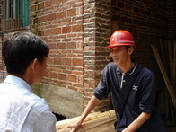

工程管理人员

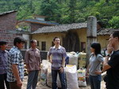

参与人

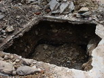

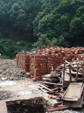

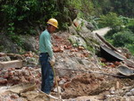

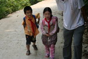

家访对象

罗海宽悄悄告诉我不想走                                                 

这么远的路去雷俊芳家。

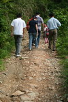

我们沿着崎岖的山路出发了

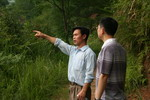

朱校长介绍山里分散的房子

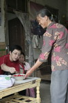

雷俊芳的奶奶

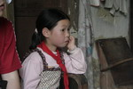

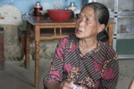

提起死去的儿子和改嫁的媳妇，奶奶老泪纵横

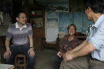

奶奶被我们逗笑了

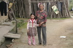

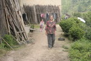

奶奶边追着边目送我们

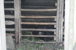

雷俊芳叔叔的牛

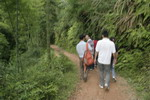

我们又出发去罗海宽的家

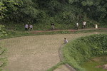

梯田插秧的人们

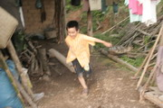

欢乐的罗海宽

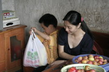

我和罗海宽

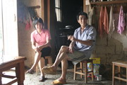

海宽的父母、喜悦的父母

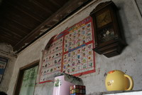

罗海宽的识字图

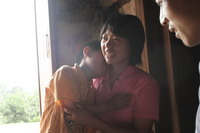

罗海宽撒娇

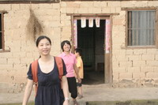

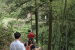

我们又出发往回走

路上放学的孩子

6月15日我们又来到遑洞，工地已经在施工了。

我们又家访了罗海宽和雷俊芳家。罗海宽是我上次答应了要去他家的；雷俊芳是孤儿，和奶奶住在一起。小小年纪经常皱起眉头，若有所思。。。。。。

罗海宽家是目前我在遑洞见到的最快乐的家庭，父母勤劳、聪明，家庭负担少。种田、桃子、杨梅，家境殷实，家庭齐整。

