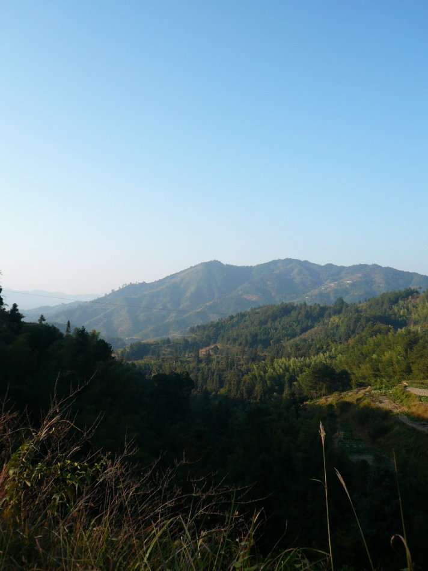
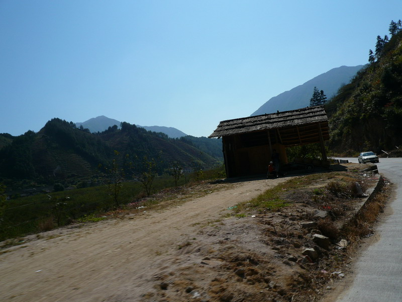
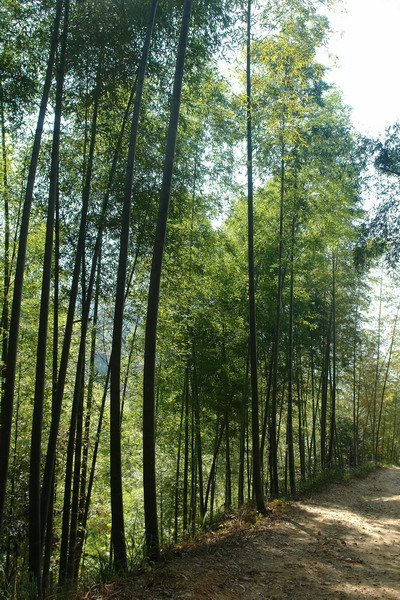

# 对山的景仰 

(2007-12-03 10:34:52)

　　遑洞明天希望小学由2007年元月24日选点至今落成，我一共去了十多次。

​　　小学坐落在广东粤北山区南岭山脉中，与湖南仅仅相隔2公里。

​　　由乐昌进遑洞的山路开车大约要走2个多小时，是一条铺了水泥的窄小省道，沿着山势弯蜒盘桓。每次穿越于山岭之间，望着车窗外的景色、感受着车在山野间忽上忽下、兜兜转转的时候，觉得自己已经便成了鸟儿在山林间飞翔。山是如此高大宏伟，令人不禁肃然起敬。南岭山脉阻隔了北方南下的冷空气，令广东保持四季如春的景致和不太寒冷的气候，而生活在南岭的山民却每年仍要抵受着严寒和雪霜，特别是遑洞村，由于气候的原因，农作物生长不十分好，他们仍然清贫。对山的敬仰也包括了对他们的崇敬。

​　　随着进遑洞的次数增多，每次去都有回家的感觉。那里有孩子们热切的盼望，有乡亲们淳朴的热情，人自然多了一份牵挂。每去一次，都是对心灵的洗涤，渐渐地心里越来越明净，越来越怀有感激之情。因为在我们帮助他们的同时，他们也帮助我们重新回归心灵的纯净！

