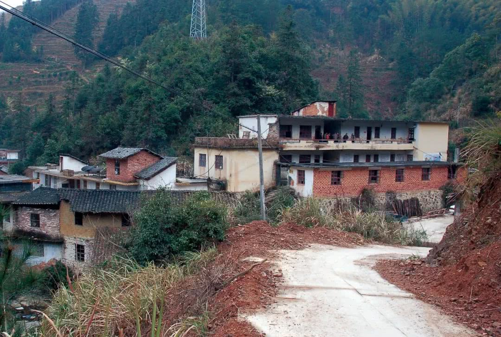
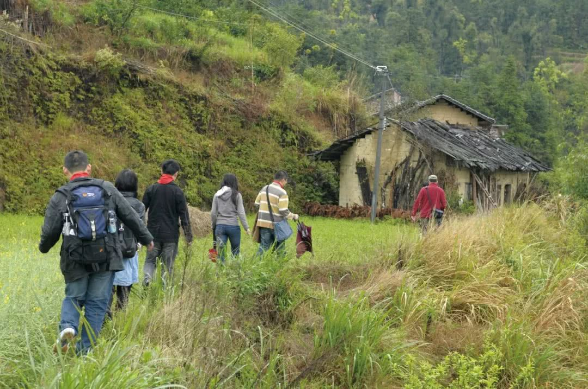

# 遑洞小学，爱可以重来

小楼小楼 2019-01-19 01:08

深冬，广州出发，目标乐昌市九峰镇遑洞村，从高速到平路再绕着蜿蜒的山路，我们来到了粤北与湘的接壤地。这里是贫困的山区人烟稀少，却满目起伏树林小溪水声仙飘空气，依然相信事物是公平的，当你以为自己什么都没有但你的背囊却是鼓鼓的，拥有许多。

这次与新的援建朋友清宇小虎一伙十人来看看这个我们2007年援建的遑洞明天希望小学。虽然已是旧址，也时隔七年没来了，但在我们这群人的心里学校一直还在，因为它代表着爱和精神。

离小学五十米虽然已看到建筑外墙被反复涂贴数回，但我们没有细看而是快步跑上台阶走入学校。毕竟大中午了，村书记村委还有原来这学校的朱校长和徐老师都在等我们，在过街廊已经摆上两桌欢迎我们，借着热腾腾的土鸡火锅和鲜嫩菜心大家错落的举杯，让来者在大冬天吃的红脸暖心。这时，再次响起那些熟悉感激之言，我拍了一下新书记大腿，打断了他，向他了解这些年这里的使用情况，他说这七年使用还好他们村委和乡亲们都愿意到这里，也对原来援建的资料保存完好，我正想看看有什么需要重整翻新，给些意见。书记却用力捏着酒杯抽一口烟，带着兴奋复杂的心情说，村委会马上要建新的，上级说要改善…..我喝上一口酒环视四周，这里满墙红彤彤和那不远的遍绿大山，我没有再细听思绪却带着我重新翻阅2007那个这里的丁亥猪年。

（缘起2006）也是在一个冬天，老蒋金城老范和我像往常一样在南国聚会，一起总是海阔天空特别有老范更无边无际，那天谈艺术策展、设计空间、原创动漫、品牌建立、运营模式。突然在间歇的一刻，我和几位哥哥提议要不我们去做一个希望小学，毕竟我们有专业资源，身边不少有爱的朋友。大家站立举杯唱和，觉得为孩子做些事情是很有意义的，我也嬉笑大家一辈子坏事不少，就好好做件好事，也不仅建一个讲台，让蒋老师金老师范老师为孩子们上课，也是造个无边的舞台让参与者齐欢共舞。

（小学选址）既然是大家的舞台就要更公正平等，在第一步是选址，我们就没考虑和启动者有关系的地方，希望找到一处陌生而有需要的。当时南都记者范铁及他的朋友许智勇推荐的乐昌九峰镇偏远山区的一个村落小学，2006年乐昌经历百年不遇的水灾，对建筑物还是有很大冲击的。2007春节前夕我们踩点，沿途去乐昌教育局了解水灾对学校的影响，和石局长他们对选这个遑洞小学观点和意见，看了现场，了解了学校的历史和使用现状，觉得是我们能力范围所及，而且小学朱校长和村委村民都很淳朴，我们就定点遑洞。记得在回去路上，我和镇中心小学徐校长走了一段田路，分享我们这些人做这事很简单心理，也与他参观了九峰镇里其它村落的希望小学，他们的学校都是打着捐建人大大的名字，我们不需要，在遑洞小学加上“明天希望”就好。

（规划设计）此刻，当我写这一段的时候，再回看自己写的学校设计说明，发现少了这个学校结构设计张胜森老师的名字，真的如此？我赶紧用笔补上，他为学校的基础和楼面处理去过五次现场，没想到这个名字漏写了十二年，抱歉。确实在这个学校的设计上很多不同的学者艺术家和其它共同援建者，都在现场或纸上给予了很多思路观点，最后由我和JJ•陈、王珏一起完成建筑设计。我们的原则是不论谁出钱，作为一所希望小学“简洁、适用、经济”的设计原则是必须的，为了考虑走了很长山路的孩子们，把原来的两层建筑改为一层，而且保留它原有的青石台阶和毛石挡土墙。我们为学校设计了图书纪念馆，让孩子看书学习的时候，还会了解原来旧校的历史原貌，同时也能感受这么多叔叔阿姨对他们的付出和关爱。彭剑还特地为他们设计了校旗，让孩子和家长们远远就能看到，心里充满了阳光充满了希望。（也是那年，色胆就开始从作品中爬上来了）

（筹款建造）要做成一个希望小学，筹款是很重要。在南国爱心聚会，大家用不同方式出力，艺术家刘佑局孙兆路吴冠英蒋悦出画出字，让有心人义买，而当年家庭之星漫友刘坚设计院和许多朋友都纷纷付现支持。像金六福门业不仅提供了学校的课室门，还在整个工厂发动捐款，虽然是五块十块但那份心意很重要，所以有些朋友今天大家都能留下来，其实那份观念是相近的，袁洁也算一个，学校的瓷砖也是她长途跋涉运上山。朱校长签名的明信片，让爱心大使Flora传递到每个援建者，彭剑也专门做了网站让大家浏览援建过程和开支。而在往后的拆旧建新的过程就由陈榆江和刘子远负责施工管理，三个多月，刘工一直住在遑洞村，从土建到学校布置一丝不苟，成为爱抽烟爱吃鸡的村民。

（新校启用）2007年9月13日，敲锣打鼓，“遑洞明天希望小学”完美落成了，我们这个援建团队还能做什么？有，还有很多事情可做，我们在校园里种了一棵校树、设置了老师补贴、颁发每学期奖学金，还继续走访在校每个学生的家庭，用我们的脚去度量每个学生回校的距离，去和她们的家长聊聊生活聊聊孩子。家长开始都以不解的眼神看着我们，当发现我们是真正无所求的为他们建造一个全新学校，也开始信任喜欢这种无缘的爱，都热情留下我们吃饭，我们尽量不打扰她们。这些年，一批批的援建团队来到学校都是夜宿课室，清早起床吃面扫地，升国旗校旗给学生做活动，然后家访。在我印象里金城来上美术课、刘子远与小朋友用天文望远镜夜观星象、和同学们做快乐夏令营。印象最深是那年深冬的营火晚会，那红红的篝火，让孩子和老乡们兴奋中都带着泪光，我们一起共舞击掌拥抱。人，一辈子，能感动别人感动自己是最幸福的，但能有几回。

（2011与今天）希望小学就是这么热情高涨的走过五年，2011年乐昌教育局石局长给老范来了个电话说所有的村小学取消，全部回到镇中心小学上课，我们所捐赠的学校建议留给村委会，听一下我们的意见，国家政策谁都改变不了，我们也只好接受。办理交接，我们还是去遑洞走了一程，希望那些同学去中心小学好好念书，也希望村委会能好好保存学校的原貌，我们有空会回来看学校看她们的。

事隔七年，我们和新朋友来看看曾经的学校，也更多是想看看当年那些小朋友成长的样子，时隔十二年，当年那些六七岁的孩子们会是怎样呢？我们约访了三个家庭，有两家的小孩当年在遑洞念书，姐姐徐健群在湛江读大学，弟弟徐健在乐昌城关中学读高三，当年调皮的孩子长的很高了读书蛮好。孩子的爸爸妈妈也希望陈榆江能继续和他们联系，因为从小就受我们的关心和影响，应该说陈榆江是这么多年对孩子付出最多的援建成员，是孩子王。另一家的女儿徐良群已在清远上大学，我们在拼命找照片中相识的孩子，爸爸也是找了半天才指出女儿，不过说起自己的女儿爸爸眼神总是幸福的，也不忘给我们递橘子，她家的土房也已改造成砖楼。朱校长喜欢抽烟，烟一直挂在嘴角吸着，仍像当年指着北面那座山说，他媳妇家在郴州，最近又当爷爷了，已经是两个孙子一个外孙的人了，他常说知足常乐。第三家的小孩都很小，孩子妈妈说四年三个，奇怪，她们很喜欢小虎，三个围着她转，我问校长为什么来这家，他说妈妈也曾在老遑洞小学念过书，希望她的三个小孩知道山脚那个建筑是个希望小学，很多有爱的人为村里建的。

时间过去十二年了，一个轮回，看着同行的“村民”刘子远和老乡一再告别，我在车里推上了窗，自己也情不自禁了。在想，这片遑洞的热土需要我们再来，三年以后为建筑再上彩。