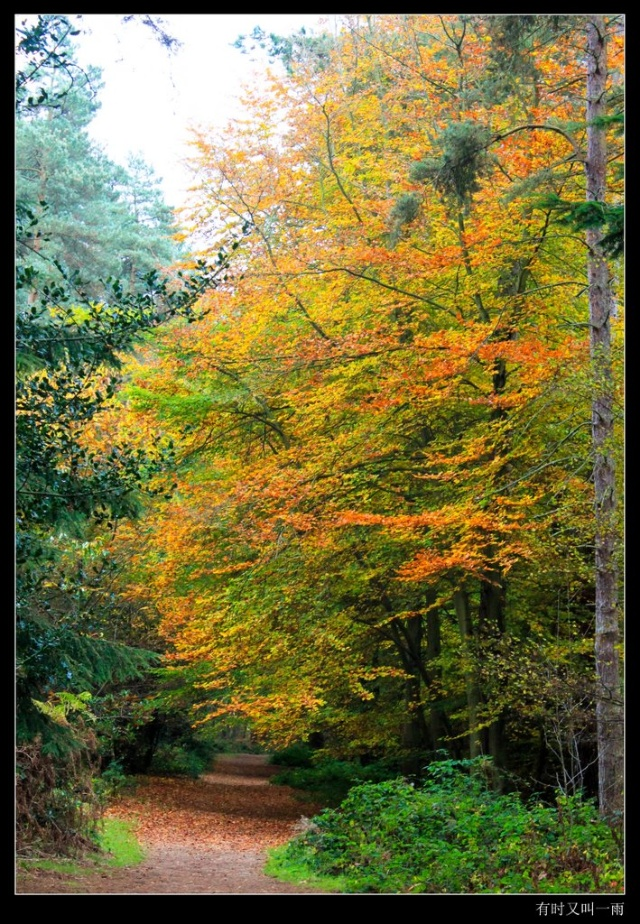
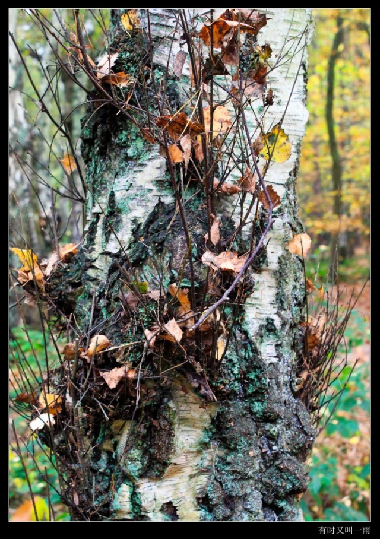

# 深秋风情

分类：[如许风月](http://grommit.blog.sohu.com/entry/7551161/) | 标签： [随想 ](http://tag.blog.sohu.com/%CB%E6%CF%EB/)  [深秋 ](http://tag.blog.sohu.com/%C9%EE%C7%EF/) 

2009-11-01 04:05

夜已深，秋更浓，凝望窗外，薄雾下远处的人家灯火零星朦胧地闪烁着，   那一幕一幕深秋风情的景象却清晰地涌现脑际……

​        “深秋风情”是个聚会的名称，亦公亦私，开心尽情热烈。因公是因了发起主办这个活动的是一家园林家居设计师楼，参加者有行业的企业、专家学者、文化界的朋友和同城媒体的记者编辑，每次的活动都有鲜明的主题供参加者议论探讨；因私是因了老板黄先生是老朋友，也是个好玩之人，深秋聚会给了我们这些终日奔波忙碌的人暂缓脚步，梳理凌乱思绪和“仰望星空”的机会，颇有醉翁之意不在酒的意味。

​         我是“深秋风情”的元老及忠实拥趸，虽已不再负责家居版面的采编，但总会在受邀之列。第一次的深秋风情在广州从化温泉，那些家装、设计界的老板专家学者在研讨会后离去了，只剩下媒体的同行们。入黑后我们坐在流溪河边，把盏言欢下竟唱起了一首首曾经伴着我们成才的老歌，仿佛又回到了童真年代，直至夜深人静仍意犹未尽。第二届深秋风情在南昆山，寒夜里点起了篝火，融融的暖意令人们放下城府，抹掉伪装，抛却了凡尘俗世，浮躁烦嚣，阔谈风月的声浪响彻寂夜，忘情地享受那片刻的超脱。第三届的深秋风情最浪漫，深秋的庐山让一对曾经擦肩而过的情侣情愫再生，回穗后即结为秦晋之好。第四次深秋风情可谓最有意义，聚会的地点在韶关乐昌县新落成的遑洞·明天希望小学。

​         遑洞·明天希望小学是黄先生在其设计师楼15周年之际捐资兴建的。当时广东韶关刚经历了一场百年一遇的水灾，滔滔洪水把很多乡间小学冲毁，那些贫困山区的适龄儿童因而失学，通过与当地教育管理部门的接洽沟通，选址在韶关市乐昌县九峰镇遑洞乡兴建一所希望小学。与通常的捐赠有别，黄先生和公司除直接出资20万元外，还承担整个校舍的设计施工监理等一系列工作，确保善款真正地用在刀刃上。由于希望小学的建设工程需要资金40多万元，黄先生便动员各界友好捐资捐物，并得到了众多热心人士的捐助，包括了设计师楼的员工们、各界好友和著名的书法家、画家、漫画家的作品捐赠，令善款总数达到60多万元。希望小学于2007年9月迎来了第一批学生，但黄先生和一众热心人士的善举并没有停止，遑洞·明天希望小学的教师津贴、困难学生生活补助、教师支教和夏令营等活动至今仍然有序地进行中。细心的黄先生还为希望小学建立了网站，把各项活动的成果放在网上供大家浏览，让爱心人士留名，也令善款的收支透明化，起到极好的监督作用。**『附遑洞·明天希望小学网址****http://www.hdmtxwxx.com/course.htm****』**

​      我有幸成为希望小学的援建人员之一，参与了其中的部分事务，尽一分自己的绵力。虽然如今人在英伦，仍惦念着那里的一切，尤其在这深秋时分，依然被那份温馨温暖的深秋风情所感动着。

