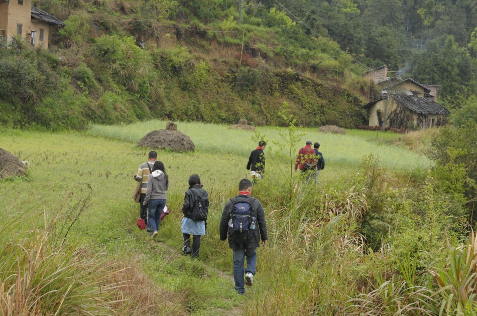
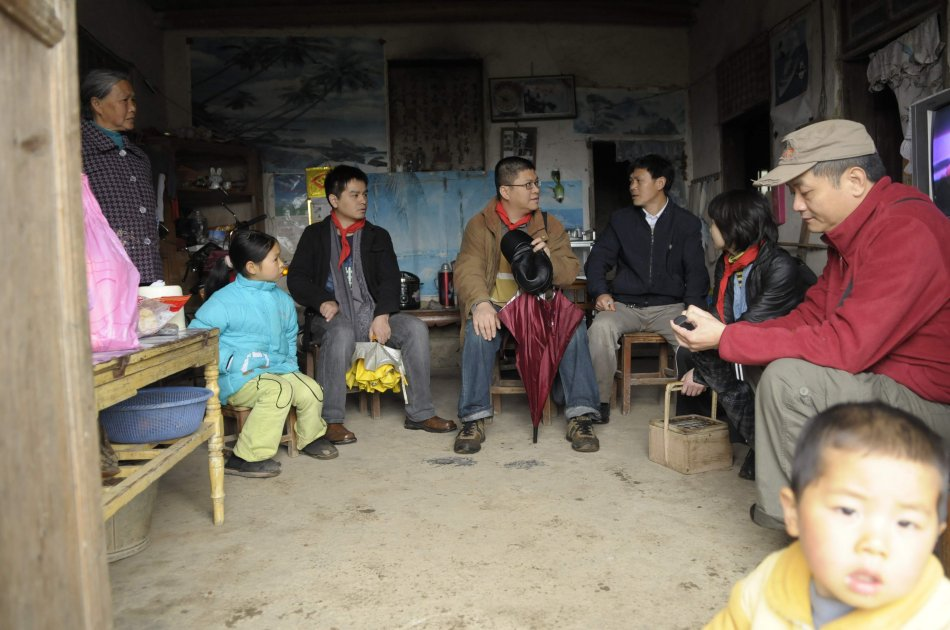
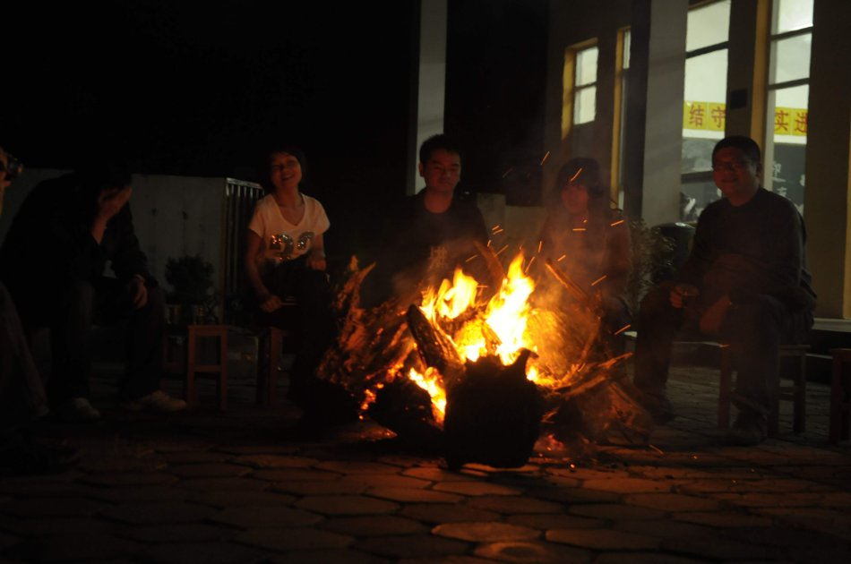
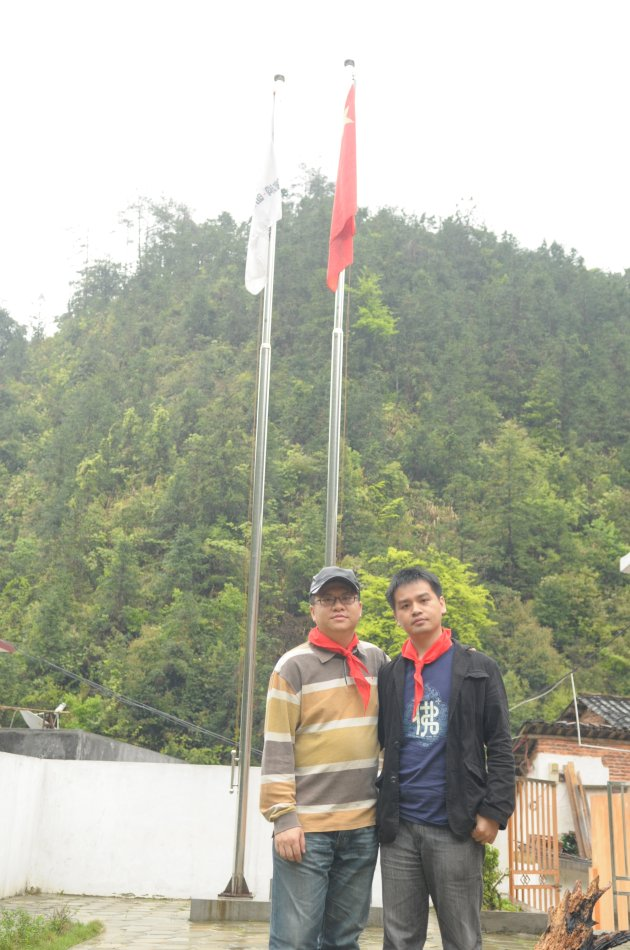
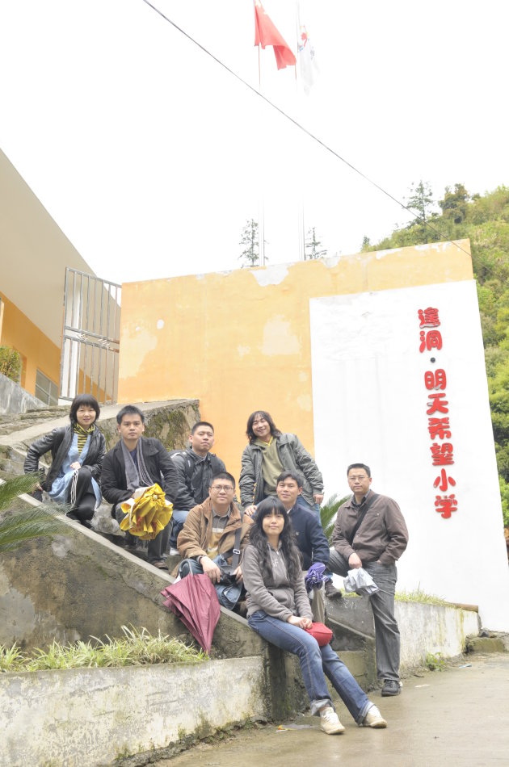

# 遑洞之晤

(2009-04-17 11:53:29)

   两台车，八个老友，一个目的地。出广州城一直向北。遑洞。

​    这个在粤北深山老林的宁静里模糊不清的小村子，因为朋友援建的一座希望小学而有了可堪遥念的理由。所有未曾谋面的想象都急欲解开扣子。今天，我们从三百五十公里外的地方起程向它靠近，想念和向往也在一同加速。

​    时值清明，一天烟雨下得不紧不慢，并不见有丁点忧伤的况味，相反，我们都爱这素洁的冷静，这催护新生的温柔和耐性。朦朦胧胧、恍恍惚惚中自有一种广度、气度和深度。天地之间，早已混淆了雾雨风的界线，或化作浮岚在山间游弋，在山腰徘徊，在山尖汩汩流动。水墨交融的酣畅，濯洗着世间万物争春的欲望，也荡涤着我们世俗翻滚于心的老练。

​    七小时的车程，让我们几个老朋友有机会把自己敞开，就着山景清谈人生，把那些长久隐匿的心事和紧张繁复的心情放逐在一次简单的出发中。及至遑洞近郊，天地倒像我们的心境一般转而变得清澈空灵，日头在云堆里隐隐透露些柔暖的光晕。略约小桥，槎桠独树，田野里爆青的芽苞正在萌动，山冈上偷孕的小花绽开酡颜。远山流云是最羞涩的隐藏，青瓦白墙是最和谐的存在。长风走过，雨脚已远。这些素颜的意象，这些煽情的诗料，都已久违多时了。

​    抵达遑洞的时候，已经是下午三四点钟了。村子里的房屋补丁似的缀在半山腰上，沿着山坡往上走，一排橙色的校舍在苍翠的山旮沓里显得灵动而有生气。阳光从云层的缝隙中透射下来，与橙色的墙身打了个照面，用它自控的温度、强度、色度表达着一种呵护的情意。能量、热力、希望、青春活力，我所能感应到的词汇即时如太阳的光芒般条件反射地四溅开来。

​    如此近距离地面对大山的伟岸身姿，去感受绿意盎然的熙攘和层次之美，内心悠然而生敬畏。那逶迤而来的山瀑，积攒着清明雨水的力量，张扬地发出声响，未料，竟让原本冗长的静寂愈发显得厚实。四处氤氲的山野之气，轻触发肤的问候，融入血液的微凉，刺激着灵性的细胞难以自抑的亢奋。那一刻起，所有的感受都被修辞。我们卸下了行李，也卸下了旅途的疲惫和世俗刻意装扮的皮囊。

​    我们围着学校前前后后里里外外看了个遍，对着图纸了解它改建前后的每一个变化，细细领会每一处设计的巧思和体贴，体察援建者的用心和真心。因为放假，我们没能在这里看到孩子们的笑脸，却从一桌一椅一花一木的完好如初中品出了珍惜，感受到一丝朴素的欣慰。不约而同地，我们都想为这里做点什么。我们挽起袖子，细心地擦洗着这里的每一扇门每一面窗户每一张桌椅，目光专注而具体。一种简单而深刻的快乐写在每个人的脸上，劳动让我们在这个地方更加明晰各自的存在。我试图以这样的方式让自己由一个初来乍到的探访者变成援助建校的直接参与者。

​    等一切收拾停当，村子里家家户户的炊烟和饭菜的香味已经撒开了薄暮。我们也买了些新鲜的山笋、老土鸡和豆腐包之类的特产，几个村干部家的女人在学校厨房里帮我们张罗了一桌香喷喷的农家菜，嫂子们的手艺都不错，校长老朱带来的土米酒也很香醇，捧出来的都是热腾腾的情意。我们邀村干部一道坐在课室外面，斟着夜色把酒话桑麻，心与声的接近、碰撞、交接，亲热的空气向着心房漫溢。

​    当天晚上，我们就在学校里过夜，拼起桌子铺上棉被，那些遗忘了经年的生活体验被一下一下叩打着唤醒，让人好生忆念。可是许多平平仄仄的东西还没来得及细细体味，我竟没能抵挡住土米酒的后劲，不争气地早早睡去了，错过了许多秉烛夜谈的精彩细节，留下了此行唯一没有与同伴共同度过的三小时空白。

 

​    遑洞的清晨有一种清心净虑的化积效验，那是治愈式的。昨夜一场小雨又润泽出一片新绿，挟着纯净、挟着清爽、挟着凛冽。一种加强的观感在叶簇、花瓣、露珠、鸟翼上苏醒。面对这一望无际的沉寂，沉默也是身不由己的。很快，这种沉默便置换成了肃穆。在老朱的安排下，我们在学校里举行了一个简单而隆重的升国旗、校旗仪式。我平生第一次作为旗手将五星红旗升上了天空。是的，就在遑洞的这个清晨，乍暖还寒的时候。从此，我有了更多的理由去铭记。戴上红领巾的那一刻，我们都成了遑洞希望小学中普普通通的一员。没人去留意这一路来的身份变化，融合，常常是悄无声息的，这里的山水人情有着天然的纯化和同化力量，无论是它的美丽，还是，哀愁。现在，我们要往山中继续漫溯，去家访，去直面现实，直面贫困。我是换了一身行装去的，以诗情和浪漫为衣，不合身。

​    我们沿着湿滑的山路崎岖地寻行。是的，这样的土地种不出丰盈的收成。老朱说，山民们只能把希望转化成对山林的十年乃至数十年的守望，以及背井离乡安身立命的奢望。“村里的男人多半外出务工去了。”

​    我伸出的手，握着的是东山头一个叫小芳的小女孩的手。前几年，她的父亲在外地打工遭遇一次翻车事故，死在了异乡。没多久，她的母亲改嫁了。现在，她和年迈的老奶奶相依为命。这是一个十分乖巧的小姑娘，她用清澈如水的眼眸和微笑同我们交流，没有丝毫的羞赧。一双温暖的小手，传递给我们相当小巧的喜悦。她很坚强。但才下眉头又上心头的隐忧仍像潮水一般向我们覆盖过来，生命中幼稚与成熟的两扇大门已经同时向他们开启，除了真诚的鼓励，我们只能笑着担忧。

​    家访回来的路上，再看那些云中的山、山上的云已不那么单纯。谁的如云的心事，谁的如山的负担，谁的轻烟般的命运。

 

​    我们知道，绝望其实远比贫穷更可怕，因为它将贫穷由一个处境变成了宿命。脱贫，以至摆脱贫穷的遗传式的恶性繁殖，最有效的方法仍然是对教育的投资。我们要把希望把爱刻录在他们心灵的底片之上。我想，这也是当初朋友将学校命名为“明天希望小学”的缘由罢。我们之于他们，“希望”是一个名词；他们之于我们，“希望”则是一个动词。

 

​    离开遑洞时，远山近峦上的云雾正在一点一点地向天空隐去，大山把它们的筋骨、脉络秀出来，深深浅浅的绿，零零散散的绿，忽隐忽现的绿，还有知名的不知名的树种，裸露的岩石和曲曲折折的溪流。那些宛如蓬莱仙境般的迷朦之美正在消失，但我们却不曾像现在这样看得真切、悠远。大自然，似乎在告诉我们一个隐语……。只是遑洞，我们方才离开，却已开始想念。

**谨以此文献给遑洞，献给同行的七个伙伴：大J、黄翔、张轶、小峰、彭剑、阿美和霖霏。且以文字的方式将当时的感觉进行贮存和保鲜，权当作日后各自温习、回忆的念想罢。**

​                                                       秦莺飞    09/04/10