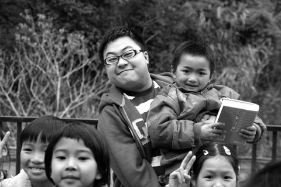
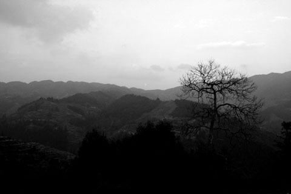
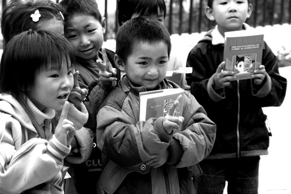
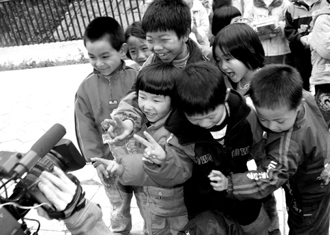
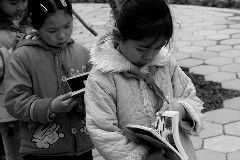
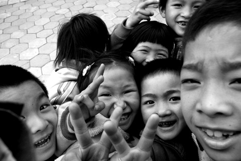
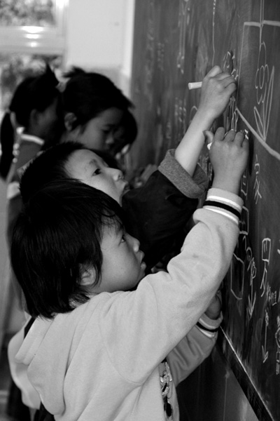
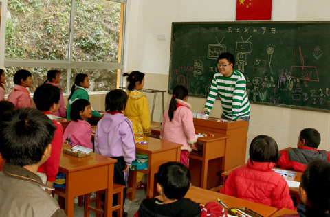
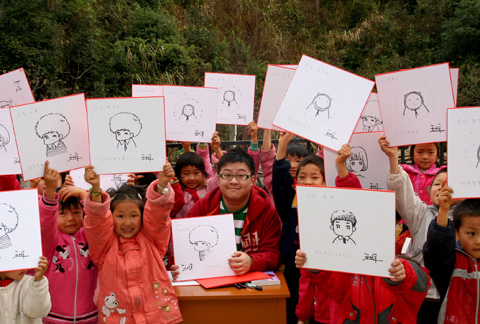
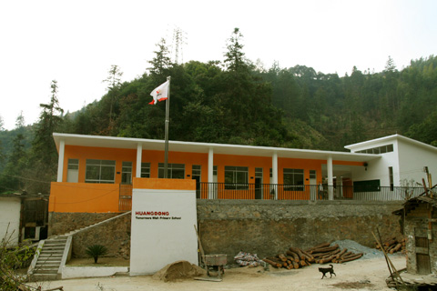

# 来自大山的呼喊

 (2008-01-14 15:38:31)

 顺着蜿蜒的山路翻过几座大山，整整七个小时的车程，终于到了地处广东和湖南交界的贫困山区。我们这次要在这里的一所希望小学拍宣传片。

​    起先工作人员告诉我这里条件可能会很艰苦，也许晚上要吃住在教室，夜里会很冷很黑很无聊，可能会下雨让山路变得很难走……然而我却对这些突然萌生了一份莫名的期待，马上连连答应了这份工作……

​    这所名叫“遑洞·明天希望小学”的学校并没有之前脑海中勾画的破旧。因为社会爱心人士的捐助，这里已经在几个月前重建了全新的校舍。整个学校一共二十五名学生、两位老师、一位校长。我给这里的孩子们上了一堂漫画课，让他们画出自己的梦想，整堂课都在孩子们的笑声中进行着，老师们都带着很认真的表情坐在教室后面，很多村民都带着朴实的笑容从窗口探进头来，还有一只大狗摇摇晃晃地走进教室和我擦身而过又推开后门若无其事地走出去了……（更夸张的是第二天有一个狗队，大约六七只狗窜过教室……但学生和老师貌似都见惯不怪了……—___—）

​    这次最难忘的事是我要跟一个小女孩回家，要拍几组在路上和在她家中的镜头，于是我们一行人跟着她一气爬了一个多小时的山，其间有好几次我都想趴在地上不走了，因为实在走不动了，我气喘吁吁地弯腰跟在后面，混身的衣服都快湿透了……想起她每天都要走两次这样的山路，真是无法形容的敬佩和难过……不过听说这里的孩子最远的每天来回要走四个小时的山路……真是不敢想象。

​    小女孩家里的橘子、干薯、茶、辣椒都是自己家种的，这里的人一直过着自给自足的生活，我不由地开始崇拜起他们……

​    回来下山的路上伸手不见五指，五个人两支手电筒，鉴于从前有从山坡上滚下来的阴影，我一直小心翼翼地走在队伍中间。不敢看路的左边，因为是一片悬崖……我好奇地问身后的校长在这样的地方生活不会枯燥无味吗？他反而觉得住在城市那么多楼那么多车生活起来才比较麻烦……他指着另一座山上说他母亲此时应该已经睡了，他能说出远处山上那些亮着的星星点点的灯火分别是谁的家，他说在山里住惯了的人会体会到另一种幸福。我不经意地抬起头看到满天的星星，好大好亮，像钻石挂在夜空，我从未在城市见到如此明亮的星星，突然有种说不出的幸福。

​    连夜画出三十张签名板，签好带来的书，幸福地闭上眼睛，听见远处传来公鸡的叫声，天亮了。第二天的拍摄在孩子们的欢声笑语里度过，每当被这些淳朴笑脸和天真的笑声包围的时候，我都有种要落泪的冲动。

​    有许多梦，或许对于这些孩子来说都太奢侈了，可我知道他们一直在默默地努力着。

​    或许有一天，他们有的会走出大山，有的会永远留在这里，而无论何时，希望属于他们快乐和幸福永远挂在他们的淳朴的笑脸上。

